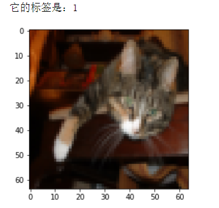
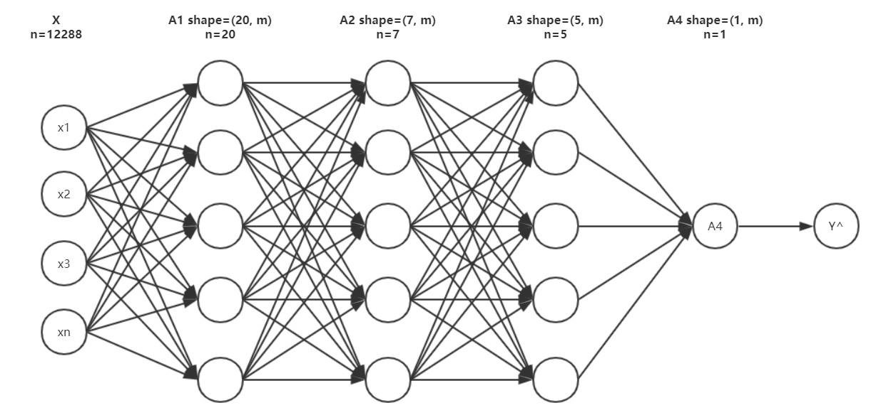
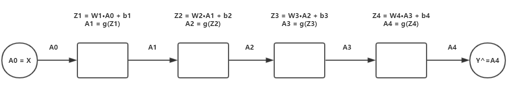
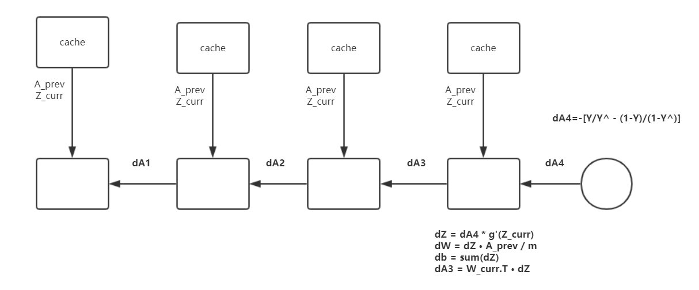
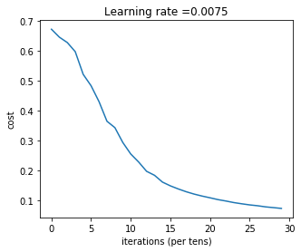
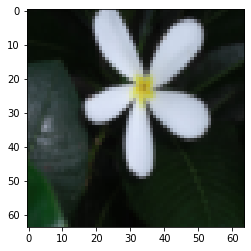

**搭建简单神经网络来识别图片中是否有猫**

代码借鉴地址：[纯用NumPy实现神经网络](https://github.com/SkalskiP/ILearnDeepLearning.py?spm=a2c4e.10696291.0.0.3d6c19a4H7VBzc&file=ILearnDeepLearning.py)

> 搭建一个简单易懂的神经网络来帮你理解深度神经网络
> 通过简单的猫识别的例子来帮你进一步进行理解
> 本代码用 numpy 来实现，不含有正则化，批量等算法


**这里我们先来理清楚神经网络的步骤**

(1) 构建数据。我们要构建出这样的一个数据，shape = (n, m)，n 代表特征数，m 代表样本数
(2) 初始化参数。使用随机初始化参数 W 和 b
(3) 前向传播。
(4) 计算损失。
(5) 反向传播。
(6) 更新参数。
(7) 构建模型。
(8) 预测。预测其实就是重新进行一次前向传播

> 清楚了这些步骤之后，我们在构建神经网络的时候就不至于无从下手了
> 接下来我们就根据上面理出来的步骤开始一步一步来构架深度神经网络吧
---
**目录**
[toc]

## 1 构建数据

**我们先来看一下数据集是怎样的**

我们从 h5 文件中来获取我们需要的数据
这里，我准备了两个文件，一个是 test_catvnoncat.h5，另外一个是 test_catvnoncat.h5，第一个文件里面放置的是训练集，第二个文件放置的是测试集

```python
# 从文件加载数据的函数
def load_data():
    # 把文件读取到内存中
    train_dataset = h5py.File('datasets/train_catvnoncat.h5', "r")
    train_x_orig = np.array(train_dataset["train_set_x"][:]) # 获取训练集特征
    train_y_orig = np.array(train_dataset["train_set_y"][:]) # 获取训练标签

    test_dataset = h5py.File('datasets/test_catvnoncat.h5', "r")
    test_x_orig = np.array(test_dataset["test_set_x"][:]) # 获取测试集特征
    test_y_orig = np.array(test_dataset["test_set_y"][:]) # 获取测试标签

    classes = np.array(test_dataset["list_classes"][:]) # 类别，即 1 和 0
    
    # 现在的数据维度是 (m,)，我们要把它变成 (1, m)，m 代表样本数量
    train_y_orig = train_y_orig.reshape((1, train_y_orig.shape[0]))
    test_y_orig = test_y_orig.reshape((1, test_y_orig.shape[0]))
    
    return train_x_orig, train_y_orig, test_x_orig, test_y_orig, classes
```

**我们可以输出这些图片看看**

```python

from random import randint
import matplotlib.pyplot as plt

# 加载数据
train_x_orig, train_y, test_x_orig, test_y, classes = load_data()

# 随机从训练集中选取一张图片
index = randint(0, 209)
img = train_x_orig[index]

# 显示这张图片
plt.imshow(img)

print ('它的标签是：{}'.format(train_y[0][index]))
```
演示结果为：


**转换数据**

> 因为我们的数据为是标准的图片数据，我们要把它转换成符合我们输入的格式
> 也就是 (n, m) 格式，n 代表特征数，m 代表样本数量

```python

train_x_orig, train_y, test_x_orig, test_y, classes = load_data()

m_train = train_x_orig.shape[0] # 训练样本的数量
m_test = test_x_orig.shape[0] # 测试样本的数量
num_px = test_x_orig.shape[1] # 每张图片的宽/高

# 为了方便后面进行矩阵运算，我们需要将样本数据进行扁平化和转置
# 处理后的数组各维度的含义是（图片数据，样本数）
train_x_flatten = train_x_orig.reshape(train_x_orig.shape[0], -1).T
test_x_flatten = test_x_orig.reshape(test_x_orig.shape[0], -1).T 

# 下面我们对特征数据进行了简单的标准化处理（除以255，使所有值都在[0，1]范围内）
train_x = train_x_flatten/255.
test_x = test_x_flatten/255.

```
最后输出数据是 (12288, m) 维度的，12288 代表特征，即 64\*64\*3=12288

## 2 随机初始化数据

**定义神经网络的结构**
在初始化之前我们要明白我们要搭建的这样一个网络的结构是如何的，这里我们采取下面的方式来定义网络的结构



```python

# 定义神经网络的结构
'''
即有四层，第一层为 12288 的特征输入，第二层有 20 个单元，以此类推
'''
nn_architecture = [
    {'input_dim': 12288, 'output_dim': 20, 'activation': 'relu'},
    {'input_dim': 20, 'output_dim': 7, 'activation': 'relu'},
    {'input_dim': 7, 'output_dim': 5, 'activation': 'relu'},
    {'input_dim': 5, 'output_dim': 1, 'activation': 'sigmoid'}
]
```

**初始化**

```python

# 根据结构随机初始化参数 W, b
def init_params(nn_architecture):
    
    np.random.seed(1)
    
    # 用来存放产生的参数
    params = {}

    for id, layer in enumerate(nn_architecture):
        # layer_id -> [1, 2, 3, 4]
        layer_id = id + 1
        params['W' + str(layer_id)] = np.random.randn(layer['output_dim'], layer['input_dim']) / np.sqrt(layer['input_dim'])
        params['b' + str(layer_id)] = np.zeros((layer['output_dim'], 1))
    
    return params
```

## 3 前向传播

**先来看看前向传播做了些什么事情**



**激活函数**

```python

def sigmoid(Z):
    '''
    参数
    Z: shape = (output_dim, m) # output_dim 指当前层的单元数
    
    返回值
    1/(1+np.exp(-Z)): sigmoid 计算结果 shape = (output_dim, m)
    '''
    return 1/(1+np.exp(-Z))

def relu(Z):
    '''
    参数
    Z: shape = (output_dim, m) # output_dim 指当前层的单元数
    
    返回值
    np.maximum(0, Z): relu 计算结果 shape = (output_dim, m)
    '''

    return np.maximum(0,Z)
```

**构建单层前向传播**
也就是我们在一层内做了些什么，我们用这个函数来实现它

$$Z\_curr = W\_curr·A\_prev + b\_curr$$
$$A\_curr = g(Z\_curr)$$

```python

# 单层前向传播
def layer_forward(W_curr, b_curr, A_prev, activation):
    '''
    计算
    Z_curr = W_curr·A_prev + b_curr
    A_curr = g(Z_curr)
    
    参数
    W_curr: 当前层的 W 参数
    b_curr: 当前层的 b 参数
    A_prev: 上一层的 A 矩阵
    activation: 当前层要用的激活函数
    
    返回值
    Z_curr: 当前层的 Z
    A_curr: 当前层的 A
    '''

    Z_curr = np.dot(W_curr, A_prev) + b_curr
    
    # 判断激活函数并求 A
    if activation == 'relu':
        A_curr = relu(Z_curr)
    elif activation == 'sigmoid':
        A_curr = sigmoid(Z_curr)
    else:
        raise Exception('不支持的激活函数类型！')
    
    return Z_curr, A_curr
```

**构建完整的前向传播**
完整的前向传播网络中，我把 Z_curr 和 A_prev 封装成一个字典放入当前层的缓存中，以便后面进行梯度下降的时候用到，然后再把所有层的缓存构成一个列表 caches，这个 caches 我们在后面要用到，所以这里我们要返回两个数据 A 和 caches

```python

# 完整前向传播
def full_forward(X, params, nn_architecture):
    '''
    参数
    X: 输入
    params: W, b 参数存放的变量
    nn_architecture: 结构
    
    caches 存储格式
    因为反向传播的时候也要用到上一层的 A，
    所以这里把上一层的 A，当前层的 Z 存入到 caches 中，方便调用
    caches = [
    {'A_prev': A_prev, 'Z_curr': Z_curr}, # 第一层存储的数据
    {'A_prev': A_prev, 'Z_curr': Z_curr}, 
    ...
    ...
    ]
    
    返回值
    A_curr: 最后一层的 A ,也就是 AL(Y_hat)
    caches: 存放上一层的 A 和 当前层的 Z 的列表
    '''
    caches = []
    
    # X 作为第零层 A
    A_curr = X
    
    for id, layer in enumerate(nn_architecture):
        # layer_id -> [1, 2, 3, 4]
        layer_id = id + 1
        
        # 获取上一层的 A
        A_prev = A_curr
        
        # 从 params 中获取当前层的 W 和 b
        W_curr = params['W' + str(layer_id)]
        b_curr = params['b' + str(layer_id)]
        # 从 layer 中获取激活函数
        activation = layer['activation']
        
        # 求当前层的 Z 和 A
        Z_curr, A_curr = layer_forward(W_curr, b_curr, A_prev, activation)
        
        # 把 上一层的 A 和 当前层的 Z 放入内存
        caches.append({
            'A_prev': A_prev,
            'Z_curr': Z_curr
        })
    return A_curr, caches
```

## 4 计算损失

**计算损失的公式**
$$J(cost) = -\frac{1}{m} [Y·log(Y\_hat).T + (1-Y)·log(1-Y\_hat).T]$$

```python

# 获取损失值
def get_cost(Y_hat, Y):
    # 获取样本数量
    m = Y_hat.shape[1]
    
    cost = -1 / m * (np.dot(Y, np.log(Y_hat).T) + np.dot(1 - Y, np.log(1 - Y_hat).T))
    
    # cost 为一个一行一列的数据[[0.256654]], np.squeeze 让其变成一个数值
    cost = np.squeeze(cost)
    
    return cost
```

**这里我们还可以定义一个函数来求准确度**


```python

# 把预测值进行分类，预测值求出来都是一些小数，对于二分类问题，我们把对他分成两类
def convert_into_class(Y_hat):
    # 复制矩阵
    prob = np.copy(Y_hat)
    # 把矩阵里面所有的 >0.5 归类为 1
    #                  <=0.5 归类为 0
    prob[prob > 0.5] = 1
    prob[prob <= 0.5] = 0
    
    return prob

# 获取准确度
def get_accuracy(Y_hat, Y):
    # 先进行分类，再求精度
    prob = convert_into_class(Y_hat)
#     accu = float(np.dot(Y, prob.T) + np.dot(1 - Y, 1 - prob.T)) / float(Y_hat.shape[1])
    # 上面的注释的方法也可求精确度
    '''
    这里我们的原理是，把预测值和真实值进行比较，相同的，
    就代表预测正确，就把他们的个数加起来，然后再除总的
    样本量，Y_hat.shape[1] 就代表总的样本量
    '''
    accu = np.sum((prob == Y) / Y_hat.shape[1])
    accu = np.squeeze(accu)
    
    return accu
```

## 5 反向传播

**还是一样我们先来看看反向传播的结构**



主要步骤就是，我们先通过 J(cost) 求出对 A4 的偏导 dA4，再进行单层的反向传播, L 代表最后层，l 代表当前层
$$dA^{L} = -(\frac{Y}{Y\_hat} - \frac{1-Y}{1-Y\_hat})$$

**对激活函数进行求导**

```python

'''
计算dZ
dZ = dA * g(Z) * (1 - g(Z))
'''
def relu_backward(dA, cache):  
    '''
    dA: shape = (output_dim, m) # output_dim 为当前层的单元数
    cache: shape = (output_dim, m)
    '''
    Z = cache
    dZ = np.array(dA, copy=True) # 复制矩阵
    
    # When z <= 0, dZ = 0
    dZ[Z <= 0] = 0
        
    return dZ

def sigmoid_backward(dA, cache):
    '''
    dA: shape = (output_dim, m) # output_dim 指当前层的单元数
    cache: shape = (output_dim, m)
    '''
    Z = cache
    
    s = 1/(1+np.exp(-Z))
    dZ = dA * s * (1-s)
    
    assert (dZ.shape == Z.shape)
    
    return dZ
```

**构建单层反向传播**
在单层里面我们主要就是计算 dZ, dW, db

$$dZ^{[l]} = dA^{[l]}*g^{[l]'}(Z^{[l]})$$
$$dW^{[l]} = dZ^{[l]}·A^{[l-1]}.T$$
$$db^{[l]} = sum(dZ^{[l]})$$

```python

# 单层反向传播
def layer_backward(dA_curr, W_curr, Z_curr, A_prev, activation):
    '''
    计算
    dZ = dA * g(Z) * (1 - g(Z))
    dW = dZ·A.T / m
    db = np.sum(dZ, axis=1, keepdims=True) / m
    
    参数
    dA_curr: 当前层的 dA
    W_curr: 当前层的 W 参数
    Z_curr: 当前层的 Z 参数
    A_prev: 上一层的 A 参数
    activation: 当前层的激活函数
    
    返回值
    dW_curr: 当前层的 dW
    db_curr: 当前层的 db
    dA_prev: 上一层的 dA
    '''
    m = A_prev.shape[1] # 求出样本个数
    # 求出 dZ_curr
    if activation == 'relu':
        dZ_curr = relu_backward(dA_curr, Z_curr)
    elif activation == 'sigmoid':
        dZ_curr = sigmoid_backward(dA_curr, Z_curr)
    else:
        raise Exception ("不支持的激活函数类型！")
        
    # 分别求 dZ, dW, db
    dW_curr = np.dot(dZ_curr, A_prev.T) / m
    db_curr = np.sum(dZ_curr, axis=1, keepdims=True) / m
    dA_prev = np.dot(W_curr.T, dZ_curr)
    
    return dW_curr, db_curr, dA_prev

```

**构建完整的反向传播**
在构建完整的反向传播的时候，一定要认真核对每一个矩阵的维度
最后返回的是存放梯度值的字典 grads

```python

# 完整反向传播
def full_backward(Y_hat, Y, params, caches, nn_architecture):
    '''
    参数
    Y_hat: 预测值(最后一层的 A 值)
    Y: 真实 Y 矩阵
    params: 存放每层 W, b 参数
    caches: 存放有前向传播中的 A , Z 
    nn_architecture: 结构
    
    返回
    grads: 梯度值
    '''
    # 存放要进行梯度下降的 dW, db 参数，存放形式和 params 一样
    grads = {}
    
    # 计算最后一层的 dA
    dA_prev = - (np.divide(Y, Y_hat) - np.divide(1 - Y, 1 - Y_hat))
    
    for id, layer in reversed(list(enumerate(nn_architecture))):
        # layer_id -> [4, 3, 2, 1]
        layer_id = id + 1
        
        # 当前层的 dA 为上一次计算出来的 dA_prev
        dA_curr = dA_prev
        # 从 params 中取出 当前层的 W 参数
        W_curr = params['W' + str(layer_id)]
        # 从 caches 内存中取出我们在前向传播中存放的数据
        A_prev = caches[id]['A_prev']
        Z_curr = caches[id]['Z_curr']
        # 从当前层的结构中取出激活函数
        activation = layer['activation']
        
        # 计算当前层的梯度值 dW, db，以及上一层的 dA
        dW_curr, db_curr, dA_prev = layer_backward(dA_curr,
                                                   W_curr, 
                                                   Z_curr,
                                                   A_prev,
                                                   activation)
        # 把梯度值放入 grads 中
        grads['dW' + str(layer_id)] = dW_curr
        grads['db' + str(layer_id)] = db_curr
    
    return grads
```

## 6 更新参数

**更新参数的公式**

$$W = W - \alpha * dW $$
$$b = b - \alpha * db $$

```python

# 更新参数
def update_params(params, grads, learning_rate):
    '''
    参数
    params: W,b 参数
    grads: 梯度值
    learning_rate: 梯度下降时的学习率
    
    返回
    params: 更新后的参数
    '''
    for id in range(len(params) // 2):
        # layer_id -> [1, 2, 3, 4]
        layer_id = id + 1
        params['W' + str(layer_id)] -= learning_rate * grads['dW' + str(layer_id)]
        params['b' + str(layer_id)] -= learning_rate * grads['db' + str(layer_id)]
    
    return params
```

## 7 构建模型
前面我们把相应的每个步骤的函数都编写好了，那么我们现在只需要把他们组合起来即可

```python

# 定义模型
def dnn_model(X, Y, nn_architecture, epochs=3000, learning_rate=0.0075):
    '''
    参数
    X: (n, m)
    Y: (1, m)
    nn_architecture: 网络结构
    epochs: 迭代次数
    learning_rate:学习率

    返回值
    params: 训练好的参数
    '''
    np.random.seed(1)
    params = init_params(nn_architecture)
    costs = []
    
    for i in range(1, epochs + 1):
        # 前向传播
        Y_hat, caches = full_forward(X, params, nn_architecture)
        
        # 计算损失
        cost = get_cost(Y_hat, Y)
        
        # 计算精度
        accu = get_accuracy(Y_hat, Y)
        
        # 反向传播
        grads = full_backward(Y_hat, Y, params, caches, nn_architecture)
        
        # 更新参数
        params = update_params(params, grads, learning_rate)
        
        if i % 100 == 0:
            print ('Iter: {:05}, cost: {:.5f}, accu: {:.5f}'.format(i, cost, accu))
            costs.append(cost)
            
    # 画出 cost 曲线图
    plt.plot(np.squeeze(costs))
    plt.ylabel('cost')
    plt.xlabel('iterations (per tens)')
    plt.title("DNN")
    plt.show()
    
    return params 
```

## 8 预测

```python

# 预测函数
def predict(X, Y, params, nn_architecture):
    Y_hat, _ = full_forward(X, params, nn_architecture)
    accu = get_accuracy(Y_hat, Y)
    print ('预测精确度为：{:.2f}'.format(accu))
    return Y_hat
```

## 9 开始训练

```python

# 开始训练
params = dnn_model(
    train_x, train_y,
    nn_architecture,
)
```

这是训练后的结果
```bash

Iter: 00100, cost: 0.67239, accu: 0.67943
Iter: 00200, cost: 0.64575, accu: 0.74641
Iter: 00300, cost: 0.62782, accu: 0.72727
Iter: 00400, cost: 0.59732, accu: 0.75598
Iter: 00500, cost: 0.52155, accu: 0.85646
Iter: 00600, cost: 0.48313, accu: 0.87560
Iter: 00700, cost: 0.43010, accu: 0.91866
Iter: 00800, cost: 0.36453, accu: 0.95694
Iter: 00900, cost: 0.34318, accu: 0.93780
Iter: 01000, cost: 0.29341, accu: 0.95215
Iter: 01100, cost: 0.25503, accu: 0.96172
Iter: 01200, cost: 0.22804, accu: 0.97608
Iter: 01300, cost: 0.19706, accu: 0.97608
Iter: 01400, cost: 0.18372, accu: 0.98086
Iter: 01500, cost: 0.16100, accu: 0.98086
Iter: 01600, cost: 0.14842, accu: 0.98086
Iter: 01700, cost: 0.13803, accu: 0.98086
Iter: 01800, cost: 0.12873, accu: 0.98086
Iter: 01900, cost: 0.12087, accu: 0.98086
Iter: 02000, cost: 0.11427, accu: 0.98086
Iter: 02100, cost: 0.10850, accu: 0.98086
Iter: 02200, cost: 0.10243, accu: 0.98086
Iter: 02300, cost: 0.09774, accu: 0.98086
Iter: 02400, cost: 0.09251, accu: 0.98086
Iter: 02500, cost: 0.08844, accu: 0.98565
Iter: 02600, cost: 0.08474, accu: 0.98565
Iter: 02700, cost: 0.08193, accu: 0.98565
Iter: 02800, cost: 0.07815, accu: 0.98565
Iter: 02900, cost: 0.07563, accu: 0.98565
Iter: 03000, cost: 0.07298, accu: 0.99043
```



## 10 进行预测

```python

# 预测测试集的精确度
Y_hat = predict(test_x, test_y, params, nn_architecture)
```
预测精确度为：0.80

## 11 以图片的形式展示预测后的结果

```python

# 显示图片
# 因为测试集有 50 张图片，所以我们随机生成 1-50 的整形数字
index = randint(1, 49)
# 因为在前面，我们把数据展开成了 (12288, 50) 的矩阵，现在让它回归成图片的矩阵
img = test_x[:, index].reshape((64, 64, 3))
# 显示图片
plt.imshow(img)
# 把预测分类
Y_hat_ = convert_into_class(Y_hat)

# 把 1，0 转化成汉字并输出
pred_ = '是' if int(Y_hat_[0, index]) else '不是'
true_ = '是' if int(test_y[0, index]) else '不是'
print ('这张图片' + true_ + '猫')
print ('预测图片' + pred_ + '猫')

# 判断是否预测正确
if int(Y_hat_[0, index]) == int(test_y[0, index]):
    print ('预测正确！')
else:
    print ('预测错误！')
```
这张图片不是猫
预测图片不是猫
预测正确！


> 以上我们就搭建完成了整个实例的代码搭建，如果你要训练其他的数据集，那么更改相应的网络结构即可，针对不同的数据集，有不同的结构，比如，我们的 X 有两个特征，那么第一层的 input_dim 可以改为 2 

**\* 以上代码为学习时所记录，如果在文中有错误的地方，请联系我及时修改**
